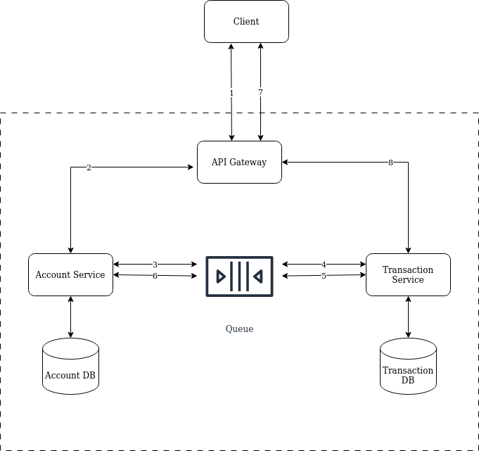

## 1. About

Demo application for banking which support:
- Creating account.
- Post transaction.
- Get an account by account number (which includes account balance).
- List transaction for an account.
- Data in domain entities is simplified for demonstration purpose.

Technologies:
- Java.
- Spring Boot.
- Maven.
- MySQL

## 2. Software Requirements

- Docker and Docker Compose.
- JDK 11.

## 3. Running Demo Application

From root folder (depends on Docker version, use `docker compose` instead of `docker-compose`)
```shell script
docker-compose up -d
./mvnw clean spring-boot:run
```

(For Windows use `mvnw.cmd` instead of `./mvnw`)

Application should be up and running at `http://localhost:8080`

## 4. Testing APIs

A sample Postman collection is at `bank-test.postman_collection.json`, which includes:
- Creating a Saving account.
- Creating a Transactional account.
- Deposit 100 to created Transactional account.
- Withdraw 50 from Transactional account.
- Withdraw 30 from Transactional account.
- Withdraw 40 from Transactional account.
- List transactions from Transactional account.

## 5. Extra questions

#### 5.1. How will you design/organize the micro-services for your API product?

Proposing to transform the current system into micro-services:
- **Components**
  - API Gateway: handle incoming requests, communicate with inner services and return response. May also include authenticating
  and authorizing, validating requests.
  - Account Service: in charge of operations related to account domain (create, check balance, etc.).
  - Transaction Service: in charge of operations related to transaction domain (transactions listing, etc.).
  - Each service within one domain should have its own database simplicity, resilience and better isolation.
  - Depends on the workload, we may want to break service in each domain (Account/Transaction) into smaller services, eg. service
  and worker. These smaller services should share database within domain to avoid excessive services communication. Usually
  this level is not needed until some scale level.
- **Communication**
  - Communication is suggested to leverage through an event queue for more streamline, less blocking, and easier to scale.
  - Service to service communication could use gRPC/Thrift or RESTful, depends on the needs and infrastructure support (service
  discovery, load balancing, etc.).


- **An example flow of transaction with micro-service design**



  - 1: Client post transaction to API Gateway.
  - 2: API Gateway validate transaction data and send a post transaction request to Account service.
  - 3: Account service check if account is sufficient to perform transaction (account status, balance amount, etc.), hold the
  transaction amount from balance and send transaction execute message to queue if success. It then return response to API Gateway.
  - 1': API Gateway return a response with reference Id to check for transaction status later or error if transaction is rejected.
  - 4: Transaction service receive transaction execute message and perform the transaction, update result to database.
  - 5: Transaction service send transaction execution complete message to queue.
  - 6: Account service receive transaction execution complete message and update balance accordingly.
  - 7: Client poll API Gateway for transaction status.
  - 8: API Gateway request transaction data from Transaction Service and return response to client.

#### 5.2. How will you break down the business requirements into user stories?

It depends on the requirement level and project size, I think one way to break down could be
- Identify personas (user type/role) and the goals or problems the business trying to solve.
- From persona's goal, map out activities/user journey to achieve the goal. Discuss on functional and non-functional requirements.
- Go through steps in user journey and map out stories, generate acceptance criteria.
- Usually those steps require engagement from multiple roles in the project (business stakeholder, domain experts, technical experts, etc.)
for successfully stories generation.
- Run for a period of time and revise, update stories base on feedback from stakeholders.